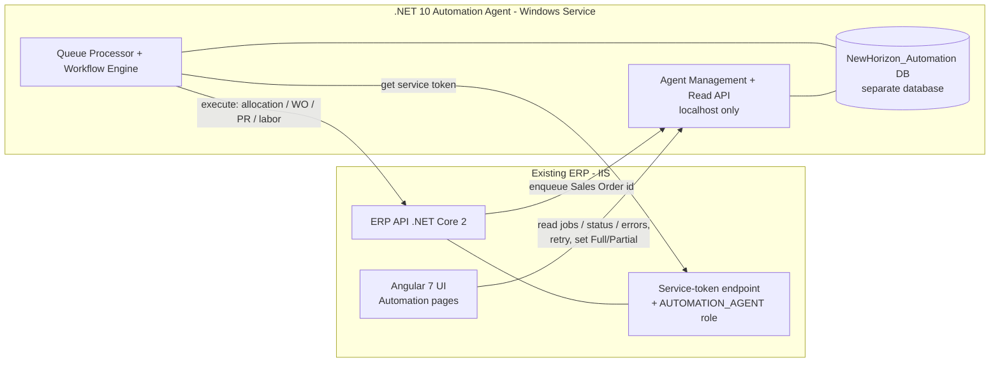
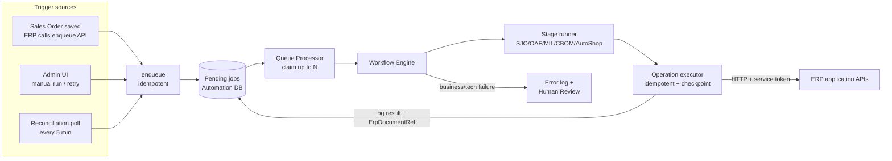
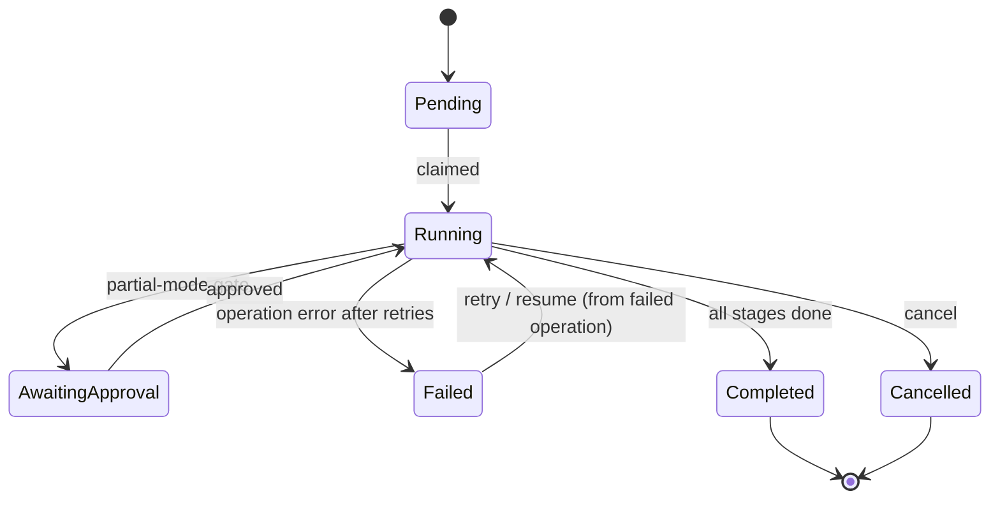

# NewHorizon Automation Agent — Solution Architecture Design (v2.0)

**Component:** `NewHorizon_AutomationAgent` — standalone .NET 10 Worker Service, hosted as a Windows Service.
**Golden rule:** ERP and Agent talk to each other **only over HTTP APIs, in both directions**. Neither ever touches the other's database.
**Version:** 2.0 — adds trigger model, agent API surface, ERP UI plan, single config file, concrete authentication, and formal Workflow → Stage → Operation granularity.

---

## 0. What changed from v1.0

- **Communication topology made explicit and bidirectional-API-only** (§2): ERP → Agent for control/read; Agent → ERP for execution. No cross-database access either way.
- **Trigger model finalized** (§6): three sources — API push, internal queue (Pending jobs), and a 5-minute reconciliation poll — all funnel through one idempotent `enqueue` path.
- **Granularity formalized** (§7): Workflow → **Stage** (your 5 "main methods": SJO / OAF / MIL / CBOM / AutoShop) → **Operation** (API-group inside a stage) → ERP API call. Checkpointing and logging happen at the **Operation** level. Resume = first non-completed operation, never a duplicate.
- **Agent API surface defined** (§10) — a tight, minimal set the ERP consumes.
- **ERP UI pages specified** (§11) — jobs list, job/status detail, retry, and click-to-see failure reason.
- **Single bootstrap config file** (§16) — SQL connection string, ERP endpoint, service auth.
- **Concrete authentication** (§15) — service-token (client-credentials) flow with the exact small ERP changes.

---

## 1. Non-negotiable principles

1. **Agent orchestrates, never writes ERP data directly.** All ERP changes go ERP API → Service → Repository → SQL. Existing validation, audit, permissions, transactions and business rules are preserved automatically.
2. **Neither side touches the other's DB.** ERP reads/controls the agent only through the agent's HTTP APIs. The agent affects the ERP only through the ERP's HTTP APIs.
3. **AI never sits in the execution path.** The decision layer only recommends (vendor, priority, risk). Every actual create is a deterministic ERP API call.
4. **Every operation is idempotent and resumable.** Crash, restart, network drop, or a double trigger must never create duplicate Work Orders / Purchase Requisitions.
5. **Non-subscribed clients are unaffected.** Automation is gated by license/package flags and config; disabled = the ERP behaves exactly as today.
6. **Deterministic, observable, replayable.** Every job carries a correlation id; every operation logs its request/response and the ERP document it produced.

---

## 2. Communication topology (who calls whom)



**ERP → Agent** (control + read): enqueue a document, retry/resume/cancel a job, set Full/Partial, and read jobs/status/errors for the UI.
**Agent → ERP** (execution): call the ERP application APIs to actually de-allocate, allocate, create WO/PR/Labor, using a service token.

This is your proposed model, and it is the right one. *Alternative considered and rejected as default:* letting the ERP read the agent DB directly for dashboards. It's slightly faster for heavy reporting but couples the two schemas and breaks the clean boundary — keep API-only. (If a very heavy reporting screen ever needs it, expose a **read-only SQL view** from the agent DB rather than opening table access.)

---

## 3. Runtime flow



---

## 4. Solution structure

Standalone Clean Architecture solution; dependencies point inward only.

```
NewHorizon.AutomationAgent.sln
├── src/
│   ├── NewHorizon.Automation.Worker          # Host: Windows Service + minimal management/read API
│   ├── NewHorizon.Automation.Application      # Use cases, workflow orchestration, ports (interfaces)
│   ├── NewHorizon.Automation.Domain           # Entities, workflow/stage/operation model, state machine
│   ├── NewHorizon.Automation.Infrastructure   # EF Core (automation DB), scheduler, logging, notifications
│   └── NewHorizon.Automation.ErpClient        # Typed ERP API clients + Polly + service-token auth handler
├── tests/
│   ├── UnitTests
│   └── IntegrationTests
├── deploy/  (install/update/uninstall .ps1, appsettings.Production.json)
├── appsettings.json
└── README.md
```

---

## 5. Layer responsibilities

**Domain** — `Job`, `JobStage`, `JobOperation`, `WorkflowDefinition`, `StageDefinition`, `OperationDefinition`, status enums, and transition invariants ("a completed operation cannot re-run", "a job in AwaitingApproval cannot advance without approval"). Pure, unit-testable.

**Application** — orchestrators and ports:
```csharp
public interface IErpClient            // one method per ERP operation the agent needs
public interface IJobRepository        // persistence for jobs/stages/operations (automation DB)
public interface IWorkflowEngine       // runs a job through stages/operations to completion or pause
public interface IDecisionService      // AI/rules recommendations (out of execution path)
public interface INotificationService
public interface IClock                // testable time (working-hours logic)
```

**Infrastructure** — EF Core repository against `NewHorizon_Automation`, `SchedulerHostedService`, `ReconciliationHostedService`, Serilog, `RuleBasedDecisionService`, migrations.

**ErpClient** — typed `HttpClient` wrappers (`IAllocationApi`, `IWorkOrderApi`, `IPurchaseApi`, `ILaborApi`, `IOafApi`, `ISjoApi`, `IMilApi`) each carrying the Polly pipeline; `ErpAuthHandler` injects the service token (§15).

**Worker** — thin `Program.cs`: DI wiring, `UseWindowsService()`, starts hosted services, maps the agent API endpoints.

---

## 6. Trigger model (finalized)

All three sources converge on one idempotent `enqueue`, so execution logic is written once.

1. **API push (primary, immediate).** On Sales Order save the ERP calls `POST /api/automation/enqueue` with the document id. Fire-and-forget — the ERP save never blocks on the agent.
2. **Internal queue.** `enqueue` inserts a **Pending** `AutomationJob` row. That Pending set *is* the queue (no external broker needed on-prem). The Queue Processor claims and runs them.
3. **Reconciliation poll (safety net, every 5 min).** A timer asks the ERP "which Sales Orders exist with no started automation job?" and enqueues the gaps. This catches anything the push missed (agent was down, ERP call failed).

**Why this combination is correct:** push gives low latency; the poll gives at-least-once delivery; **idempotency** (§14.1) makes running both safe — a doc already enqueued by push is never re-enqueued by the poll. (A transactional outbox in the ERP would be the "purest" guarantee, but push + reconciliation achieves the same at-least-once behavior with far less ERP change — recommended.)

Working-hours and enable/disable flags (from config) gate whether the poll enqueues anything.

---

## 7. Workflow → Stage → Operation (the granularity you asked for)

Four levels. This is what makes "run one by one, log meaningfully, resume from the exact point, no duplicates" precise.

| Level | Meaning | Example | Persisted as |
|---|---|---|---|
| **Workflow** | one full run for one document | AutoShop run for SO #123 | `AutomationJob` |
| **Stage** ("main method") | ordered big steps | `SJO → OAF → MIL → CBOM → AutoShop` | grouping column on operations |
| **Operation** | API-group inside a stage; **checkpoint level** | SJO: `De-Allocate → Allocate → WorkOrder → PurchaseReq → LaborPR` | `AutomationJobStep` (one row per operation) |
| **ERP API call** | actual call(s) inside an operation | `POST /api/automation/allocation` | logged in `AutomationLog` |

- A `WorkflowDefinition` is an **ordered list of Stages**; each Stage is an **ordered list of Operations**. Stages run sequentially: one completes before the next starts — exactly your "5 main methods, one done then next".
- **Checkpoint after every Operation:** its result, the ERP document it created (`ErpDocumentRef`), and status are written before moving on.
- **Resume = first Operation whose status is not `Completed`.** Completed operations are skipped by reading their stored `ErpDocumentRef`. Combined with query-before-create inside each operation, re-runs never duplicate.
- **Future workflows are just new definitions** — a new ordered Stage/Operation list. The engine, queue, retry/resume, logging, and API surface stay untouched. This is how Sales/Purchase/Inventory/Finance agents (Chapter 20) all reuse one engine.

```csharp
public sealed record OperationDefinition(
    string Name,                 // "Allocation", "WorkOrderGeneration", ...
    int Sequence,
    Func<OperationContext, IErpClient, CancellationToken, Task<OperationResult>> Execute,
    Func<OperationContext, bool>? Precondition = null,   // e.g. WO only if children allocated
    bool RequiresApprovalInPartial = false);

public sealed record StageDefinition(string Name, IReadOnlyList<OperationDefinition> Operations);
public sealed record WorkflowDefinition(string WorkflowType, IReadOnlyList<StageDefinition> Stages);
```

**Job state machine:**


---

## 8. Stage/Operation mapping from the MRP spec

**SJO stage** (manufacturing): `De-Allocation → Allocation → Work Order Generation → Purchase Requisition → Labor PR`
- De-Allocation: release reserved stock, manufacturing items before bought-out.
- Allocation: from Free On-Hand per MRP policy; AS/MK parent allocation makes children *Allocation due to Parent* (proportional shortage reduction); existing SJO links to GRN/PO/PR released proportionally.
- Work Order: only for eligible AS/MK on net requirement; **precondition** — skip if children under a manufacturing item weren't allocated.
- Purchase Req: check pipeline + MIL docs first, attach SJO ref, create only on net shortage.
- Labor PR: only when "PR for Labor Required = Yes", vendor+operation set, WO with outside-op in-process qty > 0; create on net shortage with WO + SJO refs.

**OAF stage** (trading): `De-Allocation → Allocation → OAF Link Attachment → Purchase Requisition`.

**MIL stage** (bought-out, plant-wise minimum): `Shortage = MIL − Free On-Hand`; consider MIL pipeline docs; create only on net shortage.

**CBOM / AutoShop stages**: defined the same way once their operation lists are confirmed from the ERP.

---

## 9. Full vs Partial automation (per client, via one API)

- Mode is stored **per Company + Module** in `AutomationConfig`. Client A = `Full`, Client B = `Partial` — one agent serves both.
- **Admin toggles in the ERP UI → ERP calls `POST /api/automation/config` (one call) → agent persists to `AutomationConfig`.** No redeploy.
- **Read timing:** the agent reads config **fresh at the start of each new job** (never caches across jobs), so a flag change applies from the next job. A job already running keeps the mode it captured at creation, to avoid mid-flow inconsistency.
- In Partial mode, operations flagged `RequiresApprovalInPartial` pause the job at `AwaitingApproval`; the Admin UI shows the gate; approval resumes from that exact operation.

---

## 10. Agent API surface (minimal, purposeful)

The agent exposes a **small** set, localhost-only, split into control and read. Nothing more than the ERP actually needs.

**Control (ERP → Agent):**
```
POST /api/automation/enqueue     # {company, documentType, documentId, workflowType, mode?}  -> jobId
POST /api/automation/retry       # {jobId}            -> resumes from first failed operation (re-queued at high priority)
POST /api/automation/resume      # {jobId}
POST /api/automation/approve     # {jobId, approvedBy, remarks?}  -> releases an AwaitingApproval job from its gate
POST /api/automation/reject      # {jobId, rejectedBy, remarks}   -> ends an AwaitingApproval job as Cancelled, with audit
POST /api/automation/cancel      # {jobId}
POST /api/automation/config      # {company, module, mode, pollInterval?, workingHours?, ...}
```

**Read (ERP UI → Agent):**
```
GET  /api/automation/jobs                 # filter by status/company/date, paged
GET  /api/automation/jobs/{jobId}          # header + stage/operation timeline + current position
GET  /api/automation/jobs/{jobId}/errors   # layman reason (+ technical for admin)
GET  /api/automation/config?company=&module=
GET  /api/automation/dashboard             # running/pending/failed/retry counts, avg time, success rate
GET  /api/automation/health                # service + DB + ERP-API reachability
```

That's ~12 endpoints. Every one either enqueues/controls or reads — none executes ERP work (only the internal engine does that).

---

## 11. ERP UI pages (Angular 7, calling agent read/control APIs)

1. **Automation Jobs (list)** — all jobs with status, company, document, created/started/completed, filters. Source: `GET /jobs`.
2. **Job Detail / Status** — the Stage → Operation timeline with per-operation status and the exact current position; shows which operation is running/failed. Source: `GET /jobs/{id}`.
3. **Retry** — a button on failed jobs → `POST /retry` → resumes from the failed operation only. UI then reflects new status.
4. **Failure reason** — a "View reason" button → `GET /jobs/{id}/errors` → shows the **layman message** ("Vendor missing for item X") with technical detail expandable for admins.
5. **Dashboard** — counts and success rate from `GET /dashboard`.
6. **Config** — Full/Partial toggle and other flags → `POST /config`.

All of these call agent APIs only; no direct DB access from the ERP.

---

## 12. Data model (automation DB — `NewHorizon_Automation`, separate database)

**AutomationJob** — `Id (GUID), CorrelationId, Company, WorkflowType, DocumentType, DocumentId, Mode(Full/Partial), Priority, Status, CurrentStage, RetryCount, IdempotencyKey, CreatedDate, StartedDate, CompletedDate, RowVersion`

**AutomationJobStep** (one row per **Operation**) — `Id, JobId (FK), Stage, OperationName, Sequence, Status, StartedDate, CompletedDate, RetryCount, RequestPayload, ResponsePayload, ErpDocumentRef`

**AutomationError** — `Id, JobId, StepId, ErrorType(Technical/Business), TechnicalMessage, LaymanMessage, StackTrace, ApiEndpoint, CreatedDate`

**AutomationConfig** — per Company/Module: `EnableAgent, EnableModule, PollIntervalSec, ReconcileIntervalMin, WorkingHoursStart/End, RetryCount, ParallelWorkers, Mode, LoggingLevel, LicenseFlags`

**AutomationLog** — `Id, JobId, StepId, CorrelationId, Started, Completed, Duration, Result, Module, ApiEndpoint`

Indexes: `AutomationJob(Status, Priority, CreatedDate)` for claiming; **unique filtered index on `IdempotencyKey` where Status <> Cancelled** to hard-stop duplicate jobs at the DB level.

---

## 13. Why a separate database (your direct question)

**Recommendation: same SQL Server 2017 instance, separate database `NewHorizon_Automation`.**
- **Isolation / blast radius:** back up, restore, and migrate automation state independently of the ERP. An ERP restore or upgrade never risks automation data, and vice-versa.
- **No schema pollution:** ERP's own future migrations can't collide with automation tables.
- **Boundary physically enforced:** "agent never touches ERP SQL" becomes impossible to violate by accident — different database.
- **Same instance ⇒ zero network latency**, simple infra and backup story.

*Acceptable but not preferred:* new tables in the ERP DB under a separate schema (e.g. `automation.*`). One DB/backup, but couples ERP and automation lifecycles and invites accidental joins. For enterprise + multi-client + future multi-agent, **separate database is clearly better.**

---

## 14. Execution semantics

**14.1 Idempotency (two layers).**
- *Job level:* `IdempotencyKey = hash(Company, DocumentType, DocumentId, WorkflowType)`; the unique index rejects a second live job for the same document, so push + reconciliation can't both create runs.
- *Operation level:* before creating an ERP document, the executor checks its stored `ErpDocumentRef` or queries the ERP (create-if-absent). This is what makes resume safe and duplicate-free.

**14.2 Job claiming (parallel-safe):**
```sql
UPDATE TOP (@batch) AutomationJob WITH (UPDLOCK, READPAST)
SET Status='Running', StartedDate=SYSUTCDATETIME()
OUTPUT inserted.Id
WHERE Status='Pending' AND Priority >= @minPriority;
```
`READPAST` lets parallel processors skip locked rows instead of blocking — clean parallelism up to `ParallelWorkers`.

**14.3 Retry:** only transient failures (timeout, 5xx, breaker-open, network) retry with exponential backoff + jitter up to `RetryCount`. **Business failures never retry** — straight to Human Review with a layman reason.

**14.4 Resume:** on restart, jobs left `Running` by a dead process reset to resumable; the engine restarts at the **first non-`Completed` operation**. With operation-level idempotency this is crash-safe and duplicate-free — exactly your requirement.

**14.5 Graceful shutdown:** the stop token flows into every ERP call; the current operation finishes or is left `Running` (recoverable); no new jobs are claimed. Windows Service auto-recovery restarts; resume takes over.

**14.6 Approval vs resume (distinct semantics):** `resume` is failure-recovery; `approve` is a business decision releasing an `AwaitingApproval` gate and must record `ApprovedBy` + remarks for audit (persisted on the job and on the gated `JobStep`). `reject` ends the job as `Cancelled` with the rejector and reason recorded. The Admin UI's approval screen uses these endpoints, never `resume`.

**14.7 Retry priority:** a manual retry re-queues the job at elevated priority so it is claimed ahead of newly enqueued work — the claiming query already orders by `Priority`, so this is just a priority bump on retry.

**14.8 Data retention:** operation payloads (`RequestPayload`/`ResponsePayload`) and `AutomationLog` rows grow fast at volume. A nightly purge hosted service trims payloads of `Completed` jobs after a configurable window (default 90 days) and archives/deletes old log rows; `AutomationError` rows are kept longer (default 1 year). Retention windows live in `AutomationConfig`.

---

## 15. Authentication — how the agent calls ERP APIs smoothly

You confirmed small ERP changes are acceptable. The agent must **not** use the interactive user login flow (token expiry, force-logout, and multi-admin sessions would all break it). It needs a **service identity**.

**ERP-side changes — complete consolidated list (five items, all small):**
1. **Service-token endpoint** `POST /api/auth/service-token` taking `client_id` + `client_secret` (or a pre-shared API key) and returning a **service JWT** — a path separate from username/password login.
2. **Auth middleware tweak:** tokens carrying `type = service` are **exempt from force-logout and idle-timeout** (those rules apply to interactive users only). Give the service token a sane TTL (e.g. 60 min); the agent refreshes it.
3. **Service role** `AUTOMATION_AGENT` with least-privilege permissions (create allocation, WO, PR, labor PR). Audit logs then show the actor as "Automation Service", and ERP permission checks still enforce every call.
4. **Sales Order save hook** — one fire-and-forget call to the agent's `enqueue` endpoint after a successful save (the push trigger; wrapped so an agent outage never affects the ERP save).
5. **Reconciliation query endpoint** — a read-only ERP API like `GET /api/automation/pending-documents?since=` returning documents in a trigger state, which the agent's 5-minute reconciliation poll compares against its own jobs. Without this the safety-net poll has nothing to ask.

Items 1–3 enable authentication; items 4–5 enable the trigger model (§6). Budget all five with the ERP team up front — item 5 is the one most easily forgotten.

**Agent-side:**
- `ErpAuthHandler : DelegatingHandler` — acquires the service token, caches it, **proactively refreshes ~1–2 min before expiry**, and on any `401` re-authenticates once and retries. All ERP calls go through this handler, so operation code never deals with tokens.
- `client_secret` / API key lives in protected config (Windows DPAPI / machine store), never in source control.

This resolves all three concerns you raised: **expiry** (auto-refresh), **force-logout** (service tokens exempt), **multiple admins** (agent depends on no admin session).

*Simplest fallback* (if a full token flow feels heavy): since the agent is localhost, a **static API key header** that the ERP middleware trusts only for loopback requests, mapped to the service role. No token lifecycle, but manual key rotation and coarser audit. **Client-credentials is recommended; API key is the clean fallback.**

The reverse direction (ERP/UI → agent) is protected by a **shared API key + loopback-only binding** on the agent's endpoints, so no arbitrary process can enqueue or read.

---

## 16. Single configuration file

One bootstrap file holds only what's needed to **start and connect**. Per-tenant runtime behavior (Full/Partial, working hours, retry count) lives in the DB `AutomationConfig` and is changed via the UI, not the file.

`appsettings.json` (or `appsettings.Production.json` on the server):
```json
{
  "AutomationAgent": {
    "Database": {
      "ConnectionString": "Server=.;Database=NewHorizon_Automation;Trusted_Connection=True;TrustServerCertificate=True;"
    },
    "ErpApi": {
      "BaseUrl": "http://localhost/NH_API_PROD",
      "ServiceTokenPath": "/api/auth/service-token",
      "ClientId": "automation-agent",
      "ClientSecret": "<store-protected>",
      "TokenTtlMinutes": 60,
      "TimeoutSeconds": 30
    },
    "Host": {
      "ManagementApiPort": 5080,
      "BindToLoopbackOnly": true,
      "InboundApiKey": "<shared-secret-erp-to-agent>"
    },
    "Defaults": {
      "PollIntervalSeconds": 30,
      "ReconciliationIntervalMinutes": 5,
      "ParallelWorkers": 4,
      "MaxRetry": 3
    },
    "Serilog": { "MinimumLevel": "Information" }
  }
}
```

The three things you asked to be in one place — **SQL connection string, ERP API endpoint, and service auth** — are all here.

---

## 17. Security, observability, AI extensibility, deployment (summary)

- **Security:** agent APIs localhost-only + inbound API key; agent→ERP via least-privilege service token; secrets in protected store.
- **Observability:** Serilog with `CorrelationId` on every line; health endpoint; dashboard counts straight from the tables; OpenTelemetry-ready.
- **AI extensibility:** `IDecisionService` port — `RuleBasedDecisionService` now, `LlmDecisionService` later (DI swap), always out of the execution path; multi-agent future = more `WorkflowDefinition`s on the same engine.
- **Deployment:** separate Jenkins stage → `NewHorizon.AutomationAgent.zip`; installed as a Windows Service (PowerShell scripts) with auto-recovery; co-located with IIS + SQL Server; update = stop → deploy → run migrations → start (in-flight jobs resume).

---

## 18. Decisions — locked and open

**Locked in this baseline:** separate automation database; bidirectional API-only; three triggers via one idempotent enqueue; operation-level checkpoint/resume; service-token authentication with three small ERP changes; single bootstrap config file.

**Open (confirm before/at build):**
1. Does the ERP save handler safely fire-and-forget the enqueue call? (If not, reconciliation becomes primary — design already supports it.)
2. Client-credentials vs API-key for the service token (recommend client-credentials).
3. Do ERP create endpoints accept an idempotency key, or must the agent query-before-create? (Affects §14.1 operation logic.)
4. Exact operation lists for CBOM and AutoShop stages (needed to finish §8).
5. Which operations require approval in Partial mode (drives the `RequiresApprovalInPartial` flags).
