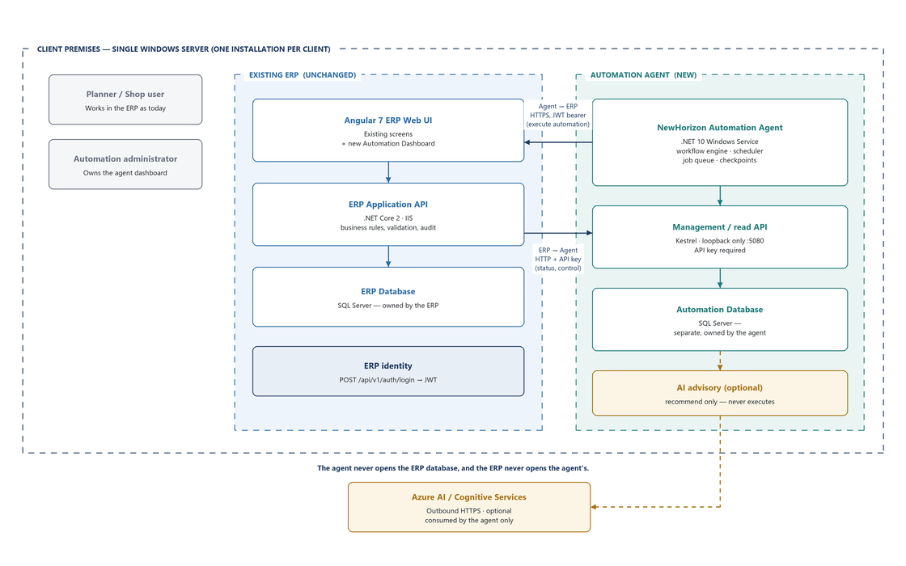
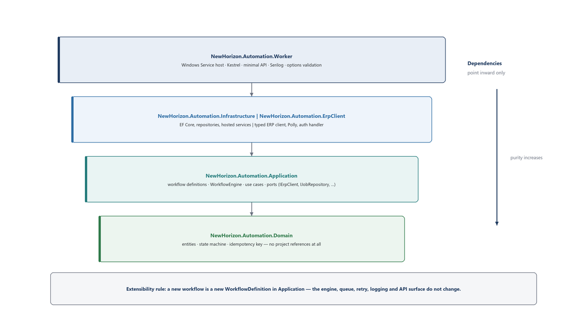
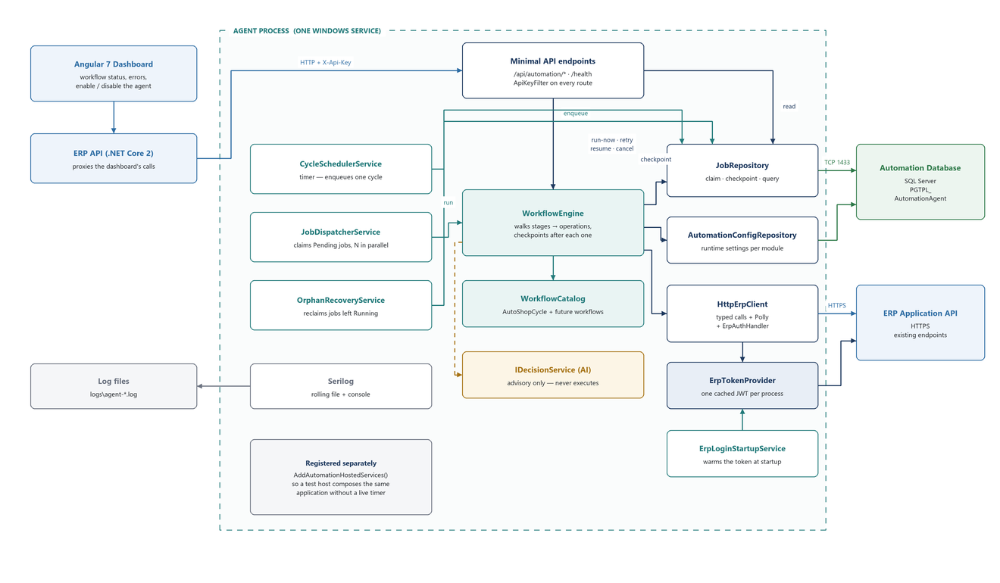
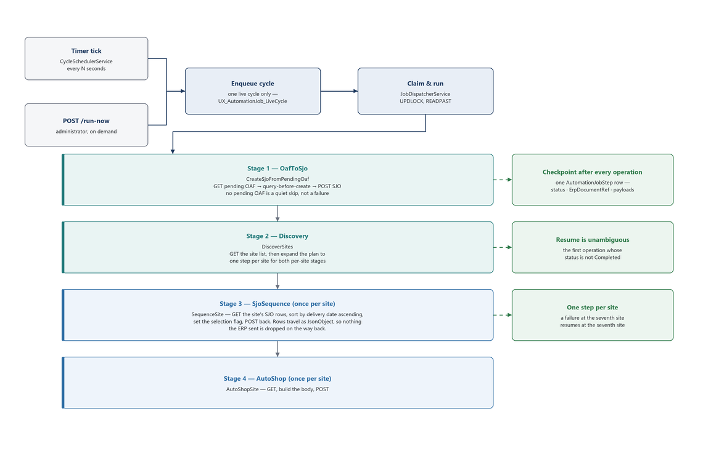
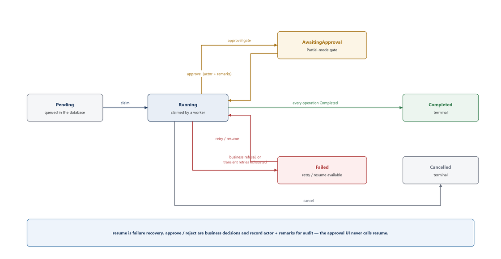
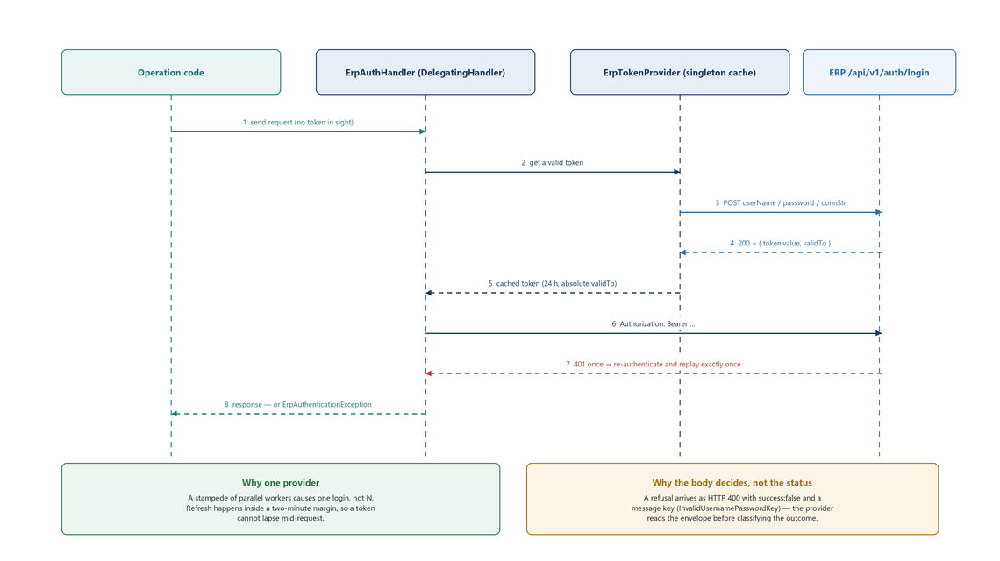
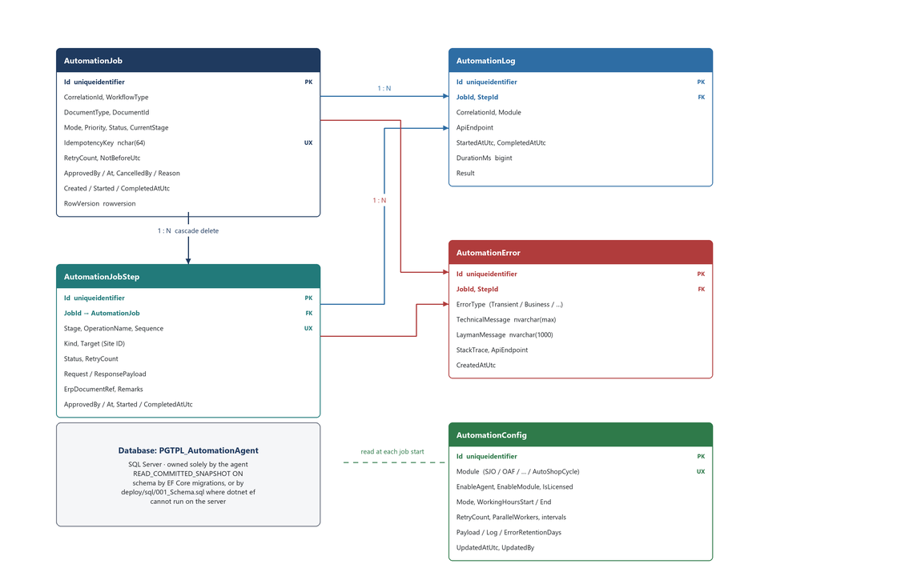
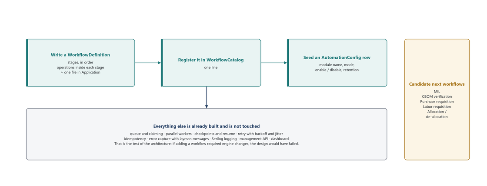
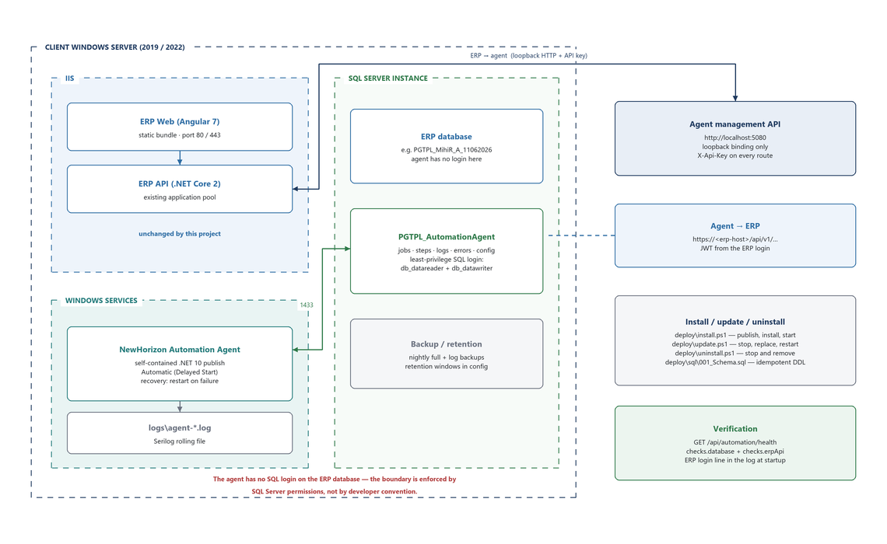

# NewHorizon Automation Agent
## System Architecture Document

| | |
|---|---|
| **Document** | System Architecture — NewHorizon Automation Agent |
| **Audience** | Stakeholders, ERP product owners, delivery and infrastructure teams |
| **Solution** | `NewHorizon.AutomationAgent.slnx` |
| **Platform** | .NET 10 · Windows Service · SQL Server · EF Core 10 |
| **Integrates with** | NewHorizon ERP — ASP.NET Core 2 API + Angular 7 UI |
| **Deployment model** | One dedicated installation per client, on the client's own Windows server |
| **Status** | Built and running. AutoShopCycle is the first live workflow; the platform is ready for more |

> This document describes the system **as built**, together with the reasoning behind each
> significant decision. It is written to be read end to end by a non-specialist stakeholder and to
> survive as the reference an engineer returns to a year from now.

<!-- pagebreak -->

## 1. Executive summary

### 1.1 What this project delivers

The NewHorizon Automation Agent is a background service that performs, unattended, the sequence of
ERP transactions that planners currently perform by hand: turning authorised OAFs into SJOs,
sequencing each site's shop jobs by delivery date, and submitting the AutoShop batch. It runs
continuously on the client's own server, it is transparent to every existing ERP user, and it can be
switched off at any moment — at which point the ERP behaves exactly as it does today.

### 1.2 The four decisions that shape everything else

| Decision | In one line | Where it is justified |
|---|---|---|
| A **separate .NET 10 service**, not a change to the ERP | The ERP stays on .NET Core 2 and Angular 7 and is not destabilised; the agent gets a modern runtime with first-class AI support | §5.1, §5.2 |
| **APIs only, in both directions** | The agent never opens the ERP database, so ERP validation, permissions, audit and transactions always apply | §5.4, §9 |
| A **separate automation database** | Job state, checkpoints and logs are the agent's own concern and must survive independently of any ERP refresh | §5.5, §10 |
| **AI advises, never executes** | Every ERP mutation is a deterministic API call; a recommendation can inform a payload but can never decide whether a document is created | §5.6, §13 |

### 1.3 What the business gets

- **Elimination of a repetitive manual loop.** The OAF → SJO → sequencing → AutoShop chain runs on a
  timer rather than on someone remembering to run it.
- **A complete audit trail.** Every ERP call the agent makes is recorded with its endpoint, duration
  and outcome, tied to a job and a correlation ID.
- **Visible, recoverable failures.** Errors carry a plain-language message for the administrator and
  a technical message for support. A failed run resumes from the exact operation that failed —
  nothing already done is repeated.
- **A platform, not a script.** The queue, retry, checkpointing, logging, dashboard and API are
  built once. The next workflow is a definition file, not a project (§12).

<!-- pagebreak -->

## 2. Business context

### 2.1 The manual process being automated

The chain from a sales order to a shop order passes through several ERP documents. Some transitions
are business decisions that must stay with a person; others are mechanical and are exactly what a
machine should do.

| Step | Transition | Performed by | The agent's part |
|---|---|---|---|
| 1 | SO → OAF | The ERP, **only after manual user authorisation** | **None.** Automation deliberately begins after this point |
| 2 | OAF → SJO | **The agent** | Creates the SJO. This is the agent's entry point |
| 3 | SJO → CBOM | The ERP, on its own | **None.** Explicitly not the agent's concern |
| 4 | SJO sequencing → AutoShop | **The agent** | Per site: GET the rows, sort by delivery date, POST back |

This ownership split is the single most load-bearing fact in the design. Because the agent never
touches steps 1 and 3, it does not need to wait on them or verify them: the site query returns only
SJOs whose BOM already exists, so an SJO created in one cycle is naturally picked up by a later
cycle once the ERP has built its BOM. The system is eventually consistent by construction, with no
polling for completion and no coordination protocol.

### 2.2 Why the unit of work is a cycle, not a document

The confirmed ERP APIs for sequencing and AutoShop are **site-scoped batches**: one GET returns all
of a site's rows, one POST submits them together. There is no per-document endpoint, and there is no
ERP event to react to, because automation starts after a manually authorised OAF.

The agent therefore runs a repeating **cycle** on a timer, and the cycle — not the document — is the
unit of work. §8 sets out how the cycle is still checkpointed finely enough that a failure never
costs more than one site's work.

### 2.3 Deployment shape and its consequence

Every client receives their own on-premise Windows server, their own ERP, their own agent
installation and their own automation database. There is consequently **no company or tenant
dimension anywhere** in the solution: no `Company` column, no tenant ID in the API surface. Site ID
is a real dimension within one client's ERP and is modelled; tenancy is not, because nothing would
ever vary by it.

<!-- pagebreak -->

## 3. Scope

### 3.1 In scope

- A Windows Service that executes automation workflows against the ERP's application APIs.
- Its own SQL Server database for job state, checkpoints, logs, errors and runtime configuration.
- A local management and read API through which the ERP drives and observes the agent.
- An administration dashboard inside the existing Angular 7 ERP UI (§14).
- The AutoShopCycle workflow, end to end.
- Installation, update and uninstallation tooling for an on-premise Windows server.

### 3.2 Explicitly out of scope

- **Any change to the ERP's database schema or data access.** The ERP database is untouched.
- **Any change to ERP business rules.** The agent calls the same APIs a user's click would.
- Steps 1 and 3 of the document chain (§2.1), which remain the ERP's and the user's.
- Public internet exposure of the agent. It listens on loopback only (§9.1).
- AI in the execution path. AI recommends; it never decides (§13).

<!-- pagebreak -->

## 4. Solution overview



Everything in the diagram above runs on a single Windows server at the client's site. The left half
is the existing ERP, unchanged. The right half is new. The two halves meet at exactly two places,
and both are HTTP:

| Direction | Purpose | Transport and protection |
|---|---|---|
| **Agent → ERP** | Execution. Every document the agent creates or updates goes through an ERP application API | HTTP(S) to the ERP's base URL, carrying a JWT obtained from the ERP's own login endpoint (§9.2) |
| **ERP → Agent** | Control and read. Status for the dashboard, plus retry / resume / cancel / run-now | HTTP to `localhost:5080`, loopback-bound, with a shared API key header (§9.1) |

Because the contract between the halves is an HTTP API, the agent can be installed, upgraded,
stopped or removed entirely without an ERP deployment, and the ERP can be patched without a rebuild
of the agent.

<!-- pagebreak -->

## 5. Technology decisions and their rationale

This section records **why** each choice was made, what the alternatives were, and what each choice
costs. These are the questions a stakeholder is most likely to ask, so they are answered directly.

### 5.1 Why .NET 10 for the agent, when the ERP is on .NET Core 2

| | |
|---|---|
| **Decision** | Build the agent on .NET 10 (`net10.0`), the current long-term-support generation |
| **Alternatives considered** | (a) Build inside the existing .NET Core 2 codebase; (b) build a separate service, also on .NET Core 2 |

The reasons, in order of weight:

- **First-class AI and Azure Cognitive Services support.** The modern Azure SDKs, the OpenAI and
  Azure AI Inference clients, and the whole `Microsoft.Extensions.AI` abstraction layer target
  current .NET. On .NET Core 2 they are either unavailable or unsupported. Since advisory AI is a
  declared direction for this product (§13), the runtime had to be one where those libraries are a
  package reference rather than a research project.
- **.NET Core 2 is out of support.** It receives no security patches. Writing new code on it would
  create a liability on day one, and the client's own security review would eventually force the
  move anyway — at a far higher cost once the automation logic had grown.
- **Everything the agent needs is now in the box.** `Microsoft.Extensions.Hosting.WindowsServices`
  for service hosting, `Microsoft.Extensions.Http.Resilience` for retry and circuit breaking,
  minimal APIs for the management surface, health checks, and EF Core 10. On .NET Core 2 each of
  these would be a third-party package, an older API shape, or hand-written.
- **Performance and footprint.** Several generations of runtime, GC and JSON improvements matter to
  a service that will run continuously for years on a machine it shares with the ERP.
- **Hiring and longevity.** The agent is expected to outlive several ERP releases. New engineers
  join a current stack far faster than a 2018 one.

**What it costs, and why that cost is zero here.** Two runtimes on one server. This would matter if
the two shared a process — but they do not: the ERP runs in IIS, the agent runs as a Windows
Service, and they communicate over HTTP. The .NET 10 runtime is either installed once on the server
or, preferably, published self-contained with the agent so the server needs nothing installed at all
(§15.2). The ERP's application pool is not touched.

### 5.2 Why a Windows Service, not IIS, a console app, or a cloud function

| | |
|---|---|
| **Decision** | Host the agent as a Windows Service (`UseWindowsService`), installed with `sc.exe` |
| **Alternatives considered** | (a) an IIS-hosted background job; (b) a scheduled console app under Task Scheduler; (c) a cloud-hosted worker |

- **It matches where the client already is.** The ERP is already installed on a Windows server with
  SQL Server. A Windows Service drops into that world with no new infrastructure, no container
  runtime, no message broker and no cloud account. Installation is one PowerShell script.
- **It starts with the machine and it stays up.** `Automatic (Delayed Start)` plus Windows' own
  failure-recovery policy means the agent returns after a reboot or a crash without anyone logging
  in. A console app under Task Scheduler cannot make that promise, and IIS will recycle an
  application pool underneath a long-running job whenever it feels the need — the classic reason
  background work inside IIS silently stops.
- **Long-running work is what it is for.** The agent holds a timer, a claim loop and in-flight ERP
  calls. IIS is optimised for short request/response work and will idle-shut-down or recycle a site;
  neither is compatible with a job that must run to completion and checkpoint as it goes.
- **Operational familiarity.** `services.msc`, the Windows event log, `sc start` / `sc stop`, and a
  standard service recovery tab are tools the client's own IT staff already use. Nothing new to learn.
- **Cloud was ruled out by the deployment model.** The ERP and its database are on-premise on a
  private network. A cloud worker would need inbound access to the client's ERP — a VPN or a tunnel,
  a security review, and a dependency on the client's internet link for work that is entirely local.

**What it costs.** The agent is Windows-only in its hosting. The code itself is not: only `Program.cs`
mentions Windows service hosting, so a future Linux or container deployment is a hosting change, not
a rewrite.

### 5.3 Why a separate project and process, rather than adding to the ERP solution

- **Different framework generation.** The ERP is .NET Core 2. A .NET 10 project cannot be referenced
  by it or built into it. This alone makes a separate deliverable inevitable.
- **Different lifecycle.** Automation logic will change as workflows are added — far more often than
  the ERP releases. Separating them means an automation change ships as a service update in minutes
  and never triggers ERP regression testing.
- **Different failure domain.** If the agent stops, the ERP is completely unaffected: users keep
  working, and the automation simply is not running. If the agent were inside the ERP, a bug in a
  retry loop would be a bug in the ERP.
- **Different shape of work.** The ERP is a request/response web application. The agent is a stateful
  batch processor with a queue, checkpoints and long-running outbound calls. Housing both in one
  process would compromise the tuning of each.
- **Clean commercial packaging.** Automation is licence-gated. A separate installable service is a
  product that can be sold, enabled, disabled and versioned on its own.

### 5.4 Why API-only integration, and never the ERP database

This is stated as an invariant rather than a preference, because violating it silently breaks
correctness:

- **Business rules live in the ERP's application layer, not its tables.** Writing to the ERP
  database directly would bypass validation, permissions, computed fields, audit trails and
  transactional boundaries. The resulting rows would look right and be wrong.
- **The schema is not a contract.** ERP tables change between releases; the application API is the
  interface the ERP team maintains and versions. Coupling to tables would make every ERP upgrade a
  risk to automation.
- **Audit and accountability.** Every document the agent creates is created the same way a user's
  click creates it, so it appears in the ERP's own audit trail with the agent's service account
  against it.
- **It is enforced, not just agreed.** The agent's SQL login exists only on the automation database.
  There is no credential in the solution that could open the ERP database even by mistake (§15.4).

### 5.5 Why a separate automation database

- **Different data, different owner.** Jobs, steps, checkpoints, API logs and errors are the agent's
  operational state. They are not ERP business data and do not belong in the ERP's schema.
- **Different lifecycle.** ERP databases at this client are refreshed and copied with dated names
  (`..._A_11062026`). Job history and checkpoints must survive those refreshes, so they cannot live
  inside one.
- **Independent scale, backup and retention.** Log and payload retention windows are tuned for
  automation volumes without touching ERP backup policy, and a purge of automation history can never
  affect an ERP table.
- **It keeps the API-only rule honest.** With its own database and its own login, the agent has no
  technical path to ERP data other than the API.

### 5.6 Why AI is confined to the agent, and to an advisory role

- **Blast radius.** All AI code, credentials, outbound calls and package dependencies live inside
  the agent. The ERP gains no AI dependency, no new outbound network requirement and no new
  vulnerability surface.
- **Determinism where it matters.** `IDecisionService` returns a vendor suggestion, a priority or a
  risk level. Whether a document is created, and with what identity, is always a deterministic API
  call. An unavailable, slow or wrong model can never change what gets created — at worst a
  suggestion is missing.
- **Auditability.** Every recommendation carries a confidence and a written rationale, so a human
  reviewing a job can see what was suggested and why.
- **Freedom to change models.** Because the interface is a port in the Application layer, the model
  behind it — Azure OpenAI, Azure AI Document Intelligence, a local model, or a plain rules engine —
  can be swapped without touching a single workflow.

### 5.7 Supporting technology choices at a glance

| Technology | Version | Chosen because | Alternative rejected |
|---|---|---|---|
| **SQL Server** | client's existing instance | Already present, already backed up, already monitored by the client's DBA. No new database engine to operate | PostgreSQL / SQLite — new operational burden for no gain |
| **EF Core** | 10.0.10 | Migrations give a versioned, repeatable schema; the model is small and query patterns are simple. Raw SQL is still used where it must be — the job-claiming `UPDATE … WITH (UPDLOCK, READPAST)` | Dapper — would mean hand-managing schema evolution across many client installations |
| **Minimal APIs** | .NET 10 | Ten endpoints, no controllers, no MVC pipeline to configure. Smaller startup and less ceremony | MVC controllers — disproportionate for this surface |
| **Serilog** | 10.0.0 | Structured logs, rolling files, correlation IDs; an operator can diagnose from a text file with no tooling | `ILogger` to the event log only — hard to search, no structure |
| **Polly / `Http.Resilience`** | 10.8.0 | Retry with exponential backoff and jitter, circuit breaker and timeouts as declarative policy rather than hand-rolled loops | Hand-written retry — the classic source of retry storms |
| **`WebApplication` host** | .NET 10 | One host provides both the background services and the management API, so there is one process, one lifetime and one DI container | Two processes — twice the deployment and twice the failure modes |
| **xUnit + integration host** | | Unit tests for pure logic; integration tests host the real application against a real Kestrel ERP stub, so sockets, headers, status codes and the 401 replay are genuinely exercised | Mock-only testing — passes while the real pipeline is broken |

<!-- pagebreak -->

## 6. Solution structure



The solution is five projects under `src/`, plus two test projects. Dependencies point inward only:
the Domain knows nothing about the outside world, and the outside world is replaceable.

| Project | Responsibility | References |
|---|---|---|
| **`NewHorizon.Automation.Domain`** | Entities (`Job`, `JobStep`, `AutomationLog`, `AutomationError`, `AutomationConfig`), the job state machine, the idempotency key. Pure logic, no I/O | *nothing* |
| **`NewHorizon.Automation.Application`** | Workflow definitions, `WorkflowEngine`, use cases, and the **ports**: `IErpClient`, `IJobRepository`, `IWorkflowEngine`, `IDecisionService`, `INotificationService`, `IClock` | Domain |
| **`NewHorizon.Automation.Infrastructure`** | EF Core `DbContext`, repositories, the three hosted services, notifications, the system clock | Application, Domain |
| **`NewHorizon.Automation.ErpClient`** | `HttpErpClient`, `ErpTokenProvider`, `ErpAuthHandler`, the resilience pipeline, the ERP health check | Application, Domain |
| **`NewHorizon.Automation.Worker`** | Composition root: the Windows Service host, Kestrel, the minimal API endpoints, Serilog, options validation | all of the above |

**Why this structure earns its keep.** The ERP's API paths, property names and even its
authentication mechanism are still being confirmed by the ERP team. Because every one of those
details lives behind a port, a change to any of them touches one adapter and no workflow logic. The
practical test is stated in §12: *a new workflow is a new definition file, and nothing else changes.*

<!-- pagebreak -->

## 7. Runtime architecture and service connections



### 7.1 The hosted services

Four background services run inside the single agent process:

| Service | What it does | Why it exists |
|---|---|---|
| `CycleSchedulerService` | The cycle's only trigger. On each tick it enqueues one cycle | Automation starts after a manually authorised OAF, so there is no ERP event to react to. A tick that finds a cycle already running does nothing — the normal case, not an error |
| `JobDispatcherService` | Claims `Pending` jobs and runs them through the engine, up to the configured parallel worker count | Separating claiming from scheduling means the queue drains at its own rate and more workers can be added by configuration alone |
| `OrphanRecoveryService` | Reclaims jobs left `Running` by a process that stopped | A service restart mid-job must not strand work. Without this, one power cut would silently park a job forever |
| `ErpLoginStartupService` | Signs in to the ERP as soon as the agent starts | A wrong password then appears in the log at startup, rather than surfacing as a mysterious mid-job failure hours later |

All four are registered by `AddAutomationHostedServices()` and `AddErpLoginStartup()`, deliberately
**separate** from `AddAutomationInfrastructure()`, so an integration-test host can compose the same
application without a live timer or a real sign-in.

### 7.2 Connection inventory

Every connection the agent makes or accepts, in full:

| # | From | To | Protocol / port | Authentication | Purpose |
|---|---|---|---|---|---|
| 1 | Agent | Automation database | TDS / TCP 1433 | Dedicated least-privilege SQL login | Job state, checkpoints, logs, errors, configuration |
| 2 | Agent | ERP application API | HTTP(S), ERP base URL | `Authorization: Bearer <JWT>` | Every automation action |
| 3 | Agent | ERP login endpoint | HTTP(S), `/api/v1/auth/login` | `userName` / `password` / `connStr` in the body | Obtaining and refreshing the JWT |
| 4 | ERP API | Agent management API | HTTP, `localhost:5080` | `X-Api-Key` header, loopback binding | Dashboard reads and control actions |
| 5 | Angular 7 UI | ERP API | HTTPS, existing ERP port | Existing ERP session | The administrator's dashboard; the ERP proxies onward to (4) |
| 6 | Agent | Log files | local filesystem | NTFS permissions | `logs\agent-*.log`, rolling |
| 7 | Agent | AI service *(optional, §13)* | HTTPS, outbound | Service key or managed identity | Advisory recommendations only |

There is no connection from the agent to the ERP database, and none from the ERP to the automation
database. That is the boundary, and §15.4 explains how SQL permissions enforce it rather than
merely documenting it.

<!-- pagebreak -->

## 8. Execution model

### 8.1 Four levels, and why the middle one matters most

| Level | Meaning | Persisted as |
|---|---|---|
| Workflow | One run — one document, or one cycle | `AutomationJob`, one row |
| Stage | A phase such as OafToSjo or AutoShop, run in order | A grouping column on the steps |
| **Operation** | An API-group inside a stage — **the checkpoint unit** | `AutomationJobStep`, one row each |
| ERP API call | A single HTTP request and its outcome | `AutomationLog`, one row each |

The agent checkpoints after *every* operation — status, ERP document reference and payloads — before
advancing. Resume is therefore defined without ambiguity: **the first operation whose status is not
`Completed`**. There is no interpretation, no heuristic, and no possibility of re-running work that
already succeeded.

### 8.2 The AutoShop cycle



| Stage | Operation | What it does |
|---|---|---|
| `OafToSjo` | `CreateSjoFromPendingOaf` | Fetch OAFs awaiting an SJO and create them. Nothing pending is the normal quiet case, not a failure |
| `Discovery` | `DiscoverSites` | Fetch the site list from the ERP and expand the plan to one step per site, for both per-site stages |
| `SjoSequence` | `SequenceSite` (per site) | GET the site's SJO rows, sort by delivery date ascending, set the selection flag, POST back |
| `AutoShop` | `AutoShopSite` (per site) | GET, build the body, POST — once per site |

Two properties of this workflow are worth a stakeholder's attention:

**The agent holds no business logic here.** Each operation is GET → build body → POST. The rows
travel as raw JSON objects rather than a typed model, so every property the ERP sent comes back
untouched; the agent only sorts by delivery date and sets one flag. Typing the row would silently
drop any field the agent's model did not know about — a whole class of data-loss bug that this design
makes impossible.

**Sites are discovered, not declared.** The site list lives in the ERP, so the plan is expanded at
run time into one step per site. Each site is then individually checkpointed: *a failure at the
seventh site resumes at the seventh site*, and the first six are not repeated.

### 8.3 Job lifecycle



| Concern | Rule |
|---|---|
| `resume` vs `approve` | `resume` is failure recovery. `approve` / `reject` are business decisions on an `AwaitingApproval` gate and must record actor and remarks for audit. The approval UI never calls `resume` |
| What is retried | Only transient failures — timeout, 5xx, network drop, open circuit breaker — retry with exponential backoff and jitter. A business refusal goes straight to human review with a plain-language message and is **never** retried |
| Manual retry | Re-queues the job at elevated priority; the claiming query orders by `Priority` |
| Claiming | `UPDATE TOP (@batch) … WITH (UPDLOCK, READPAST)`, so parallel workers skip locked rows instead of blocking on them |
| Error messages | Every error carries both a `TechnicalMessage` and a `LaymanMessage`; the ERP UI shows the plain-language one by default |

### 8.4 Idempotency — how duplicates are made impossible

Duplicate documents are the failure mode that would destroy trust in automation fastest, so
duplicate-safety is enforced at three independent levels:

1. **Job level.** A unique filtered index on `IdempotencyKey = hash(DocumentType, DocumentId,
   WorkflowType)` where `Status <> 'Cancelled'`. Two triggers racing for the same document produce
   one job, decided by the database rather than by application timing.
2. **Cycle level.** A cycle has no document, so a second filtered unique index,
   `UX_AutomationJob_LiveCycle`, admits **one live cycle per workflow type** — excluding `Completed`
   as well as `Cancelled`, because unlike a document a cycle is meant to run again.
3. **Operation level.** Each operation either finds a stored `ErpDocumentRef` from an earlier attempt
   or asks the ERP whether the document already exists before creating it. A re-run after a partial
   failure adopts what the previous attempt created rather than duplicating it.

<!-- pagebreak -->

## 9. Security architecture

### 9.1 The agent's inbound API

The management and read API is not a public API. It is consumed only by the ERP, on the same
machine, and it is protected by two independent boundaries:

- **Loopback binding.** Kestrel binds to `localhost:5080`. The port is not reachable from another
  machine at all, whatever the firewall says. This is configurable
  (`Host:BindToLoopbackOnly`) but loopback is the default and the recommended setting.
- **A shared inbound API key.** `ApiKeyFilter` is applied to every route in both endpoint groups, so
  a caller must present the configured key. Nothing is exempt except the health endpoints.

There is deliberately **no user authentication, no OAuth flow and no token issuance on this
surface** — the caller is a trusted server-side component on the same host, not a user, and adding a
user identity model would be complexity with no security gain. The identity that matters (which ERP
user the automation acts as) is established on the *outbound* side, in §9.2.

> **Point to raise with the client's security reviewer.** The two boundaries above are appropriate
> for a loopback-only service on a private server. If a future requirement exposes the agent beyond
> loopback — a separate monitoring host, for example — the API key alone is not sufficient and TLS
> plus a stronger scheme should be added at that point. The design does not prevent this; it simply
> does not pay for it today.

### 9.2 Agent → ERP authentication



The ERP has no client-credentials or service-token endpoint, and the ERP team is not adding one, so
the agent signs in through exactly the same endpoint the ERP UI uses:

```http
POST {BaseUrl}/api/v1/auth/login
{ "userName": "…", "password": "…", "connStr": "Server=…;Database=…",
  "isCEFlag": false, "appID": "", "userId": "" }

200 → { "data": { "token": { "value": "<jwt>", "validTo": "2026-07-30T03:01:23Z" } },
        "success": true, "message": null }
```

Four verified facts govern the implementation, each checked against the running ERP rather than
assumed:

- **The response body decides the outcome, not the status code.** A refusal arrives as HTTP **400**
  with `success: false` and a message key such as `InvalidUsernamePasswordKey` — not as a 401. The
  token provider therefore reads the envelope before classifying the result.
- **Tokens last 24 hours** and the response states an absolute `validTo`, which is what the cache
  honours. The configured `TokenTtlHours` is only a fallback for a response that omits it.
- **`connStr` is the *ERP's* database**, parsed by the ERP to resolve the login. The agent never
  opens it, and it is never the automation database.
- **Swagger declares a required `CompanyId` header that the endpoint does not enforce.** The agent
  does not send one. If a future ERP build starts rejecting the call, this is the first thing to check.

**The token middleware.** `ErpTokenProvider` holds one token for the whole process, so a stampede of
parallel workers causes one login rather than N. `ErpAuthHandler`, a `DelegatingHandler` in the HTTP
pipeline, attaches the token to every outbound call, refreshes it inside a two-minute margin so a
token cannot lapse mid-request, and on a 401 re-authenticates and replays the request **exactly
once** — a second 401 is a real authorisation problem that retrying would only hide. Operation code
never mentions a token.

### 9.3 Credentials and secrets

| Value | Where it lives | Why |
|---|---|---|
| Automation DB connection string | `dotnet user-secrets` locally; environment variable or DPAPI-protected store on a server | Grants direct data access; must never sit in a committed file |
| Inbound API key | Same | Same |
| **ERP login (URL, user, password, `connStr`)** | `appsettings.json`, **in clear** | A deliberate, client-requested exception. The agent runs on a private network on the client's own server, and the ERP API port changes per installation — an operator must be able to correct all of it without a rebuild. This is a documented decision, not an oversight |

### 9.4 Defence in depth, summarised

| Layer | Control |
|---|---|
| Network | Loopback-only binding; no inbound port open to the network |
| Transport | HTTPS to the ERP where the ERP offers it; loopback for inbound |
| Application | API key on every management route; ERP JWT on every outbound call |
| Data | Dedicated SQL login, `db_datareader` + `db_datawriter` on the automation database only, and **no login at all** on the ERP database |
| Process | Runs as a dedicated service account, not `LocalSystem`, with file permissions on the log directory |
| Audit | Every ERP call logged with endpoint, duration, outcome and correlation ID; approvals record actor and remarks |
| Kill switch | `EnableAgent` / `EnableModule` in configuration, and the Windows Service itself, both stop automation immediately |

<!-- pagebreak -->

## 10. Data architecture

### 10.1 The database

| | |
|---|---|
| **Database name** | `PGTPL_AutomationAgent` *(the `PGTPL_` prefix matches the client-code grouping already used on the server; `appsettings.json` ships the placeholder `NewHorizon_Automation`, which each installation overrides)* |
| **Engine** | SQL Server, the client's existing instance |
| **Owner** | The agent, exclusively. No other application reads or writes it |
| **Isolation** | `READ_COMMITTED_SNAPSHOT ON`, so the read API's queries never block the workers' job-claiming `UPDLOCK, READPAST` updates |
| **Recovery model** | `SIMPLE` by default; the client's DBA may raise it |
| **Schema management** | EF Core migrations, or `deploy/sql/001_Schema.sql` — every migration as one idempotent script — where `dotnet ef` cannot run on the server |

The name deliberately does **not** use the `_<user>_A_<ddMMyyyy>` suffix pattern seen on ERP
databases. That pattern marks dated ERP copies, whereas the automation database is long-lived state
that must outlive any individual ERP refresh.



### 10.2 Tables at a glance

| Table | Grain — one row per… | Why it exists |
|---|---|---|
| `AutomationJob` | one workflow run | The unit of work, the queue, and the duplicate guard |
| `AutomationJobStep` | one operation within a run | The checkpoint. This table is what makes resume exact |
| `AutomationLog` | one ERP API call | The audit trail and the performance record |
| `AutomationError` | one failure | Failure detail, in both technical and plain language |
| `AutomationConfig` | one module | Runtime behaviour an administrator can change without a redeploy |
| `__EFMigrationsHistory` | one applied migration | EF Core's own record of schema version |

<!-- pagebreak -->

### 10.3 `AutomationJob` — the unit of work

**Why this table exists.** It is simultaneously three things: the record of one workflow run, the
work queue itself (there is no external message broker — a `Pending` row *is* a queued job), and the
mechanism that makes duplicate runs impossible.

| Column | Type | Description |
|---|---|---|
| `Id` | `uniqueidentifier` | Primary key; the job's identity in the API and the dashboard |
| `CorrelationId` | `nvarchar(64)` | Ties every log line, API call and error of this run together, across processes |
| `WorkflowType` | `nvarchar(50)` | Which workflow — `AutoShopCycle`, `SJO`, `OAF`, `MIL`, `CBOM`, `AutoShop` |
| `DocumentType` | `nvarchar(50)` | The kind of thing the run is about; `Cycle` for a timer-driven cycle |
| `DocumentId` | `nvarchar(100)` | The ERP document's identifier; for a cycle, its start timestamp |
| `Mode` | `nvarchar(10)` | `Full` or `Partial`, **captured at creation** so a mid-run configuration change cannot alter a job already running |
| `Priority` | `int` | Claim order. A manual retry re-queues at elevated priority so an operator's action is served first |
| `Status` | `nvarchar(20)` | `Pending` / `Running` / `AwaitingApproval` / `Failed` / `Completed` / `Cancelled` |
| `CurrentStage` | `nvarchar(50)` | The stage in progress — what the dashboard shows as "where is it now" |
| `RetryCount` | `int` | Attempts so far, checked against the configured maximum |
| `IdempotencyKey` | `nchar(64)` | Hash of document type + document ID + workflow type. Backed by a filtered unique index — the duplicate guard |
| `ApprovedBy`, `ApprovedAtUtc` | `nvarchar(100)`, `datetimeoffset` | Who released an approval gate, and when. Audit, not decoration |
| `CancelledBy`, `CancellationReason` | `nvarchar(100)`, `nvarchar(1000)` | Who cancelled and why |
| `NotBeforeUtc` | `datetimeoffset` | Earliest claim time — how backoff and working-hours windows are expressed without a scheduler |
| `CreatedAtUtc`, `StartedAtUtc`, `CompletedAtUtc` | `datetimeoffset` | Queue latency and run duration, straight from the data |
| `RowVersion` | `rowversion` | Optimistic concurrency, so two workers can never both believe they own the row |

| Index | Purpose |
|---|---|
| `IX_AutomationJob_Claim` (`Status`, `Priority`, `CreatedAtUtc`) `INCLUDE (NotBeforeUtc)` | Serves the claiming query as a covering index — the hottest query in the system |
| `UX_AutomationJob_IdempotencyKey_Live` — unique, `WHERE Status <> 'Cancelled'` | One live job per document. Cancelled jobs are excluded so a document can be retried after a cancellation |
| `UX_AutomationJob_LiveCycle` — unique on `WorkflowType`, `WHERE DocumentType = 'Cycle' AND Status NOT IN ('Completed','Cancelled')` | One live cycle at a time. `Completed` is excluded because, unlike a document, a cycle is meant to run again |
| `IX_AutomationJob_DocumentId`, `IX_AutomationJob_CreatedAtUtc` | Dashboard lookup by document, and time-ordered listing |

### 10.4 `AutomationJobStep` — the checkpoint

**Why this table exists.** This is the table that turns "the job failed" into "the job failed at
operation 14 of 37, and operations 1–13 are done and must not be repeated." Without it, a failure
would mean re-running a whole cycle and risking duplicate documents. It is the single most important
table for recoverability.

| Column | Type | Description |
|---|---|---|
| `Id` | `uniqueidentifier` | Primary key |
| `JobId` | `uniqueidentifier` | Owning job. **Cascade delete** — a step has no meaning without its job |
| `Stage` | `nvarchar(50)` | Which stage this operation belongs to |
| `OperationName` | `nvarchar(100)` | Which operation — e.g. `SequenceSite` |
| `Sequence` | `int` | Execution order. Unique per job, which is what makes "the first step not `Completed`" a precise statement |
| `Kind` | `nvarchar(20)` | Execute / approval gate / verification |
| `Target` | `nvarchar(50)` | The **Site ID** for per-site operations. This is how one step per site is expressed without a separate table |
| `Status` | `nvarchar(20)` | `Pending` / `Running` / `Completed` / `Skipped` / `Failed` |
| `RetryCount` | `int` | Attempts for this operation specifically |
| `RequestPayload`, `ResponsePayload` | `nvarchar(max)` | What was sent and what came back. Support can reconstruct exactly what the ERP was asked to do, months later. Subject to `PayloadRetentionDays` |
| `ErpDocumentRef` | `nvarchar(100)` | The document the ERP created. **The operation-level idempotency guard**: present means "already done, adopt it, do not create again" |
| `Remarks` | `nvarchar(1000)` | Why a step was skipped, or an operator's note |
| `ApprovedBy`, `ApprovedAtUtc` | | Per-step approval, for Partial mode |
| `StartedAtUtc`, `CompletedAtUtc` | `datetimeoffset` | Per-operation duration — which site is slow, and when |

| Index | Purpose |
|---|---|
| `UX_AutomationJobStep_Job_Sequence` — unique | Guarantees one step per position; makes resume deterministic |
| `IX_AutomationJobStep_Job_Status` | Finds the first incomplete step, which is the resume query |

### 10.5 `AutomationLog` — the API audit trail

**Why this table exists.** Steps record *what the workflow did*; this records *every HTTP call the
agent made to the ERP*. It answers the two questions that come up in every support conversation:
"did the agent actually call us?" and "how long did it take?" It is also the evidence base for the
performance conversation with the ERP team, since it measures the ERP's response times from the
caller's side.

| Column | Type | Description |
|---|---|---|
| `Id` | `uniqueidentifier` | Primary key |
| `JobId`, `StepId` | `uniqueidentifier` | The run and the operation the call belongs to |
| `CorrelationId` | `nvarchar(64)` | Joins to the Serilog file output and, where supported, to the ERP's own logs |
| `Module` | `nvarchar(50)` | Functional area, for per-module reporting |
| `ApiEndpoint` | `nvarchar(500)` | The path called |
| `StartedAtUtc`, `CompletedAtUtc` | `datetimeoffset` | Call window |
| `DurationMs` | `bigint` | Latency, stored rather than computed so reporting stays trivial |
| `Result` | `nvarchar(50)` | Outcome classification |

Indexed by `JobId`, by `CorrelationId` and by `StartedAtUtc` — the three ways this table is read:
drilling into a job, tracing one run across systems, and reporting over a period.

### 10.6 `AutomationError` — failures in two languages

**Why this table exists.** An exception message is written for a developer. An administrator looking
at a dashboard at 7 a.m. needs to know whether to call someone or simply press retry. This table
stores both readings of the same failure, so the UI can show the plain-language one and support can
open the technical one — without either audience having to interpret the other's.

| Column | Type | Description |
|---|---|---|
| `Id` | `uniqueidentifier` | Primary key |
| `JobId`, `StepId` | `uniqueidentifier` | Where the failure occurred |
| `ErrorType` | `nvarchar(20)` | Transient / business / authentication / validation. **Drives whether a retry is even attempted** |
| `TechnicalMessage` | `nvarchar(max)` | Full detail, including the ERP's own message |
| `LaymanMessage` | `nvarchar(1000)` | What the administrator sees by default |
| `StackTrace` | `nvarchar(max)` | Developer diagnostics |
| `ApiEndpoint` | `nvarchar(500)` | Which call failed |
| `CreatedAtUtc` | `datetimeoffset` | When |

Indexed by `JobId` (the drill-down) and `CreatedAtUtc` (the "what broke today" view).

### 10.7 `AutomationConfig` — runtime behaviour without a redeploy

**Why this table exists.** Some settings are bootstrap — where the database is, where the ERP is —
and belong in a file. Others are business decisions that an administrator must be able to change at
2 p.m. on a Tuesday: whether automation is on, how many workers, how long to keep payloads, whether
a module needs approval. Putting those in a file would mean a file edit and a service restart for
every operational adjustment. Putting them here makes them a screen.

| Column | Type | Description |
|---|---|---|
| `Id` | `uniqueidentifier` | Primary key |
| `Module` | `nvarchar(50)` | `SJO` / `OAF` / `MIL` / `CBOM` / `AutoShop` / `AutoShopCycle`. **Unique** — one row per module |
| `EnableAgent` | `bit` | Global kill switch. Off ⇒ the agent does nothing at all |
| `EnableModule` | `bit` | Per-module switch, so one workflow can be paused while others run |
| `Mode` | `nvarchar(10)` | `Full` (run through) or `Partial` (stop at approval gates) |
| `PollIntervalSeconds`, `ReconcileIntervalMinutes` | `int` | How often the timer ticks and the reconciliation poll runs |
| `WorkingHoursStart`, `WorkingHoursEnd` | `time`, nullable | Optional window. `NULL` means around the clock, which is the seeded default |
| `RetryCount` | `int` | Attempts before a job is parked for human review |
| `ParallelWorkers` | `int` | How many jobs run concurrently — the main throughput dial |
| `LoggingLevel` | `nvarchar(20)` | Raise to `Debug` for one module during an investigation, without restarting |
| `IsLicensed` | `bit` | The commercial gate. Unlicensed ⇒ the ERP behaves exactly as it does today |
| `PayloadRetentionDays`, `LogRetentionDays`, `ErrorRetentionDays` | `int` | Retention windows — 90 / 90 / 365 by default. Errors are kept longest because they are the audit record |
| `UpdatedAtUtc`, `UpdatedBy` | | Who changed the automation's behaviour, and when |

`deploy/sql/002_SeedAutomationConfig.sql` seeds one row per module, idempotently. Seeding is not
strictly required — the repository falls back to defaults for a module with no row — but a seeded
installation lets an administrator *see* what the agent is going to do instead of relying on
invisible defaults.

**Configuration is read fresh at the start of each job**, so a change takes effect on the next job
rather than on a restart; a job already running keeps the mode it captured when it was created.

### 10.8 Data volume, growth and retention

| Table | Growth driver | Control |
|---|---|---|
| `AutomationJob` | One row per cycle — modest, bounded by the timer interval | `LogRetentionDays` |
| `AutomationJobStep` | Roughly `2 × site count + 2` rows per cycle | `PayloadRetentionDays` clears payloads first, keeping the cheap columns |
| `AutomationLog` | One row per ERP call — the fastest-growing table | `LogRetentionDays` (90) |
| `AutomationError` | Only failures — small in a healthy system, and a useful signal when not | `ErrorRetentionDays` (365) |
| `AutomationConfig` | Fixed: one row per module | none needed |

Payload columns are purged before their parent rows, so the operational history and the timing
record survive long after the bulky JSON has gone.

<!-- pagebreak -->

## 11. Integration architecture

### 11.1 Resilience pipeline

Registration order is execution order, outermost first:

```
total timeout ─► retry (exponential + jitter) ─► circuit breaker ─► attempt timeout ─► auth handler
```

Resilience deliberately **wraps** authentication, so a retried attempt re-enters the auth handler and
picks up a refreshed token. The other way round, a retry after a long backoff could replay a token
that had since expired.

| Strategy | Setting | Why |
|---|---|---|
| Total timeout | `max(60s, 4 × attempt timeout)` | One stuck operation cannot hold a worker for minutes while other jobs queue behind it |
| Retry | exponential, **with jitter**, `MaxRetry` attempts (default 3) | Jitter stops N parallel workers retrying in lockstep and hammering an ERP that is already struggling |
| Circuit breaker | 50% failure ratio, minimum throughput 10 | Stops flooding an ERP that is down, and fails fast so jobs park for review instead of piling up |
| Attempt timeout | `ErpApi:TimeoutSeconds` (30s) | Bounds a single call |

`MaxRetry` can legitimately be configured to zero — "never retry at the transport level" — in which
case the retry strategy is omitted entirely rather than registered with an invalid attempt count.

### 11.2 Error classification

Only transient conditions are retried or counted against the breaker. A 400 for a missing vendor is
deterministic: retrying produces the same answer and would wrongly trip the breaker against a
perfectly healthy ERP.

| Exception | Transient | Outcome |
|---|---|---|
| `ErpTransientException` | yes | Timeout, 5xx, network drop, open breaker — retried with backoff |
| `ErpBusinessException` | no | The ERP understood and refused. Straight to human review with the plain-language message |
| `ErpAuthenticationException` | yes | Could not obtain a token. Transient by nature, but called out separately because the usual cause is a wrong password, which should be obvious in the log rather than buried in retries |

### 11.3 ERP endpoints are configuration, not code

Most ERP paths and payload property names are **still unconfirmed by the ERP team**. Rather than
guess in code and rebuild on every correction, both live in `appsettings.json`:

| Setting | Value | Confirmed? |
|---|---|---|
| `ErpEndpoints:SiteList` | `/api/v1/admin/location/list` | Yes |
| `ErpEndpoints:SjoSequenceTemplate` | `/api/v1/planning/autoshopsjosequence/GetSJODetails/{siteId}/S` | Yes |
| `ErpEndpoints:AutoShopTemplate` | `/api/v1/planning/autoshop/{siteId}` | Pending |
| `ErpEndpoints:OafAwaitingSjo` | `/api/v1/planning/oaf/pending-sjo` | Pending |
| `ErpEndpoints:CreateSjoFromOaf` | `/api/v1/planning/sjo/create-from-oaf` | Pending |
| `ErpEndpoints:ExistingDocument` | `/api/automation/existing-document` | Pending |
| `AutoShop:SjoNumber` / `DeliveryDate` / `SelectionFlag` | row property names | Pending |

**Why this matters commercially.** When the ERP team confirms a path, the change is a configuration
edit and a service restart — minutes, no rebuild, no release, no regression cycle.

### 11.4 The agent's management and read API

Hosted inside the Worker, for the ERP only.

| Route | Purpose |
|---|---|
| `GET /api/automation/jobs` | List jobs, with filters, for the dashboard |
| `GET /api/automation/jobs/{id}` | One job with all its steps — the drill-down view |
| `GET /api/automation/jobs/{id}/errors` | Errors for a job; plain-language message by default |
| `POST /api/automation/jobs/{id}/retry` | Re-queue at elevated priority |
| `POST /api/automation/jobs/{id}/resume` | Failure recovery — resume at the first incomplete operation |
| `POST /api/automation/jobs/{id}/cancel` | Cancel a job |
| `POST /api/automation/run-now` | Enqueue a cycle immediately, without waiting for the timer |
| `GET /api/automation/dashboard` | Aggregate counts for the dashboard landing page |
| `GET /api/automation/config` · `GET`/`POST /api/automation/config/{module}` | Read and update per-module runtime configuration |
| `GET /health` · `GET /api/automation/health` | Liveness and readiness, including database and ERP reachability |

<!-- pagebreak -->

## 12. Extensibility — how the next workflow is added



The architecture makes one specific promise, and it is the promise on which the product case rests:

> **A new workflow is a new `WorkflowDefinition` in the Application project. The engine, the queue,
> retry, checkpointing, logging, the API surface and the dashboard do not change.**

Adding one is three additive steps:

1. **Write the definition** — the stages in order, and the operations inside each stage. Roughly one
   file. Each operation is an async function receiving a context and the `IErpClient` port.
2. **Register it** in `WorkflowCatalog` — one line.
3. **Seed an `AutomationConfig` row** for the new module, so it appears in the settings UI with its
   own enable switch, mode and retention.

Everything else is inherited automatically: the queue and claiming, parallel workers, checkpoints
and resume, retry with backoff and jitter, idempotency, error capture with plain-language messages,
Serilog logging, the management API and the dashboard. That is the test of the design — if adding a
workflow required an engine change, the architecture would have failed.

**Candidate next workflows**, in the order they are likely to be valuable: MIL, CBOM verification,
purchase requisition, labor requisition, and allocation / de-allocation. Each is a definition file
against ERP APIs that already exist or are already planned.

**Capabilities the engine already supports that no live workflow uses yet** — they are built and
tested, waiting for the first workflow that needs them:

- **Approval gates.** An operation of kind *approval* parks the job at `AwaitingApproval` until an
  administrator approves or rejects, recording actor and remarks. This is how Partial mode works.
- **Run-time plan expansion.** `DiscoverSites` proves the pattern: an operation can append steps
  discovered at run time, so a workflow can loop over anything the ERP tells it about — sites,
  vendors, lines, warehouses — while keeping each iteration individually checkpointed.
- **Verification operations.** An operation that confirms an ERP-owned transition happened, rather
  than performing it — the shape any "wait for the ERP to finish X" requirement would take.
- **Push and reconciliation triggers.** The trigger model funnels three sources — an ERP push, the
  internal `Pending` queue, and a reconciliation poll — into one idempotent `enqueue`. Only the timer
  is used today; a document-driven workflow can turn on the other two without new plumbing.

<!-- pagebreak -->

## 13. AI services — what is built, and how it grows

### 13.1 The rule

**AI is never in the execution path.** `IDecisionService` lives in the Application layer and offers
exactly three advisory operations:

| Operation | Returns | Used for |
|---|---|---|
| `RecommendVendorAsync` | vendor code + confidence + written rationale | Suggesting a vendor on a requisition, for a human or a deterministic rule to accept |
| `RecommendPriorityAsync` | a priority number | Influencing claim order — which job runs first, never whether it runs |
| `AssessRiskAsync` | risk level + rationale | A signal surfaced in the dashboard; it never gates execution on its own |

Every ERP mutation remains a deterministic API call. An unavailable, slow or wrong recommendation
must never change whether a document is created. This is the property that makes AI safe to adopt
incrementally in a system that creates real financial documents.

### 13.2 Why the agent is the right home for it

- The agent already holds the operational history — every job, every payload, every failure — which
  is precisely the training and grounding data an AI feature needs, and it holds it **without any
  ERP data being copied anywhere**.
- All AI credentials, outbound HTTPS calls and package dependencies stay inside one process. The ERP
  gains no AI dependency and no new network requirement.
- .NET 10 gives first-class access to the Azure AI and `Microsoft.Extensions.AI` client libraries
  (§5.1) — which is a substantial part of why .NET 10 was chosen.

### 13.3 A staged roadmap

Each stage is independently valuable, and each keeps AI advisory.

| Stage | Capability | Service | Where it plugs in |
|---|---|---|---|
| **1 — today** | The port exists; a deterministic implementation can be swapped for a model at any time | none | `IDecisionService` |
| **2** | **Failure explanation.** Turn a raw ERP error into the plain-language message the administrator reads | Azure OpenAI, or a small local model | At `AutomationError` creation, populating `LaymanMessage` |
| **3** | **Anomaly and risk signals.** "This cycle created 4× the usual number of SJOs" — surfaced on the dashboard, never blocking | Azure AI Anomaly Detector, or statistics over `AutomationLog` | `AssessRiskAsync` |
| **4** | **Vendor and priority recommendation.** Learn from historical payloads which vendor and which urgency the planners actually chose | Azure OpenAI with retrieval over the agent's own history | `RecommendVendorAsync`, `RecommendPriorityAsync` |
| **5** | **Document understanding.** Read an incoming PDF or scanned order and pre-fill a payload for human confirmation | Azure AI Document Intelligence | A new workflow with an approval gate |
| **6** | **Natural-language operations.** "Why did last night's cycle fail?" answered from jobs, steps, logs and errors | Azure OpenAI over the automation database | A dashboard panel calling a new read endpoint |

### 13.4 Guardrails that apply to every stage

- A recommendation is **stored with its confidence and rationale** before it is used, so any decision
  it influenced can be explained afterwards.
- A **timeout and a fallback** on every AI call: if the service does not answer, the operation
  proceeds without the recommendation. It never fails a job.
- **No ERP business data leaves the client's network** unless the client explicitly approves that
  stage. Stages 2 and 3 can run entirely on-premise; stages 4–6 need an approved data-flow decision.
- Anything with financial or contractual consequence is presented **through an approval gate**
  (§12), not applied automatically.

<!-- pagebreak -->

## 14. The ERP-side administration dashboard

A new area inside the **existing Angular 7 ERP UI** — no new application to deploy, no second login,
and the ERP's existing role-based permissions decide who may see it.

| Screen | Shows | Calls (via the ERP API) |
|---|---|---|
| **Overview** | Counts by status, last cycle result, next scheduled run, agent health | `GET /api/automation/dashboard`, `GET /api/automation/health` |
| **Workflow runs** | Job list with workflow type, status, stage, timings; filter and search | `GET /api/automation/jobs` |
| **Run detail** | Every operation with its status, site, ERP document reference and duration — a live view of where a run reached | `GET /api/automation/jobs/{id}` |
| **Errors** | Failures with the plain-language message; the technical message on demand | `GET /api/automation/jobs/{id}/errors` |
| **Actions** | Retry, resume, cancel, and run-now | the corresponding `POST` routes |
| **Settings** | Enable / disable the agent and each module, mode, working hours, workers, retry count, retention | `GET`/`POST /api/automation/config/{module}` |

**The enable/disable switch** an administrator uses writes `EnableAgent` or `EnableModule` in
`AutomationConfig`. Because configuration is read fresh at the start of each job, disabling takes
effect on the very next job with no restart, and any job already running finishes cleanly rather
than being killed mid-operation.

**Call path.** The browser calls the ERP API as it does for every other screen; the ERP API forwards
to `http://localhost:5080` with the shared API key. The agent's port is never reachable from a
browser, and the dashboard needs no new authentication mechanism — it inherits the ERP session the
user already has.

<!-- pagebreak -->

## 15. Deployment architecture



### 15.1 What is installed

| Component | Hosting | Notes |
|---|---|---|
| ERP Web (Angular 7) | IIS | Unchanged, except for the new dashboard area |
| ERP API (.NET Core 2) | IIS application pool | Unchanged, except for the proxy routes to the agent |
| **Automation Agent** | **Windows Service**, `NewHorizon Automation Agent` | `Automatic (Delayed Start)`; recovery set to restart on failure |
| ERP database | SQL Server | Untouched. The agent has no login on it |
| **Automation database** | Same SQL Server instance | `PGTPL_AutomationAgent`, dedicated login |

`ContentRootPath` is pinned to the binary location, because a Windows Service's working directory is
`%WINDIR%\System32`, which would otherwise hide `appsettings.json` — a classic and confusing
first-install failure, prevented in code.

### 15.2 Installation and update

| Script | Does |
|---|---|
| `deploy/install.ps1` | Publish, install the service, start it |
| `deploy/update.ps1` | Stop, replace binaries, restart |
| `deploy/uninstall.ps1` | Stop and remove the service |
| `deploy/sql/001_Schema.sql` | Every migration as one idempotent script — safe to re-run, and safe against a partly migrated database |
| `deploy/sql/002_SeedAutomationConfig.sql` | Seeds one `AutomationConfig` row per module, idempotently |

Publishing **self-contained** is recommended: the server then needs no .NET runtime installed, the
agent cannot be affected by a runtime upgrade performed for another application, and the ERP's own
runtime is provably untouched.

### 15.3 Verifying an installation

```powershell
curl http://localhost:5080/api/automation/health
```

Expect `checks.database = "Healthy"`. `checks.erpApi` stays `Unhealthy` until `ErpApi:BaseUrl` and
the credentials point at a reachable ERP — which makes the health endpoint the single command that
tells an installer exactly which of the two connections is not yet right. The startup log line
`ERP login successful …`, with its timestamp and token expiry, confirms the second one.

### 15.4 The SQL login

A **dedicated least-privilege SQL login**: `db_datareader`, `db_datawriter` and `EXECUTE` on the
automation database, and **nothing at all** on the ERP database. Neither `sa` nor a blank password is
ever shipped — either would give the agent's process full control of every database on the instance,
including the ERP's, and would turn the architecture's central boundary into an honour system.

### 15.5 Configuration split

| Bootstrap — `appsettings.json` | Runtime — `AutomationConfig` table |
|---|---|
| SQL connection string; ERP base URL, login path and credentials; management port, loopback binding and inbound API key; ERP endpoint paths; defaults (poll interval, parallel workers, max retry) | Enable switches, Full/Partial mode, working hours, retry count, parallel workers, logging level, licence flag, retention windows — per module, changed through the UI, never in the file |

The rule of thumb: **if an administrator should be able to change it, it is in the table; if it must
be right before the process can start, it is in the file.**

<!-- pagebreak -->

## 16. Operations and observability

| Concern | How it is served |
|---|---|
| **Logs** | Serilog, structured, rolling files under `logs\agent-*.log`, plus console when run interactively. Level is configurable per module at run time |
| **Correlation** | Every job carries a `CorrelationId` that appears on every log line, every `AutomationLog` row and every error — one identifier traces a run end to end |
| **Health** | `GET /health` (liveness) and `GET /api/automation/health` (readiness: database + ERP reachability), suitable for the client's existing monitoring |
| **Progress** | `AutomationJobStep` rows appear as the run proceeds, so the dashboard shows real progress rather than a spinner |
| **Performance** | `AutomationLog.DurationMs` gives per-endpoint ERP latency measured from the caller's side — the evidence base for any performance discussion with the ERP team |
| **Failure alerting** | `INotificationService` is a port; today a log-based implementation. Email or Teams is an adapter, not a redesign |
| **Recovery** | Windows service recovery restarts the process; `OrphanRecoveryService` reclaims jobs left `Running`; checkpoints mean a restart resumes rather than repeats |

### 16.1 Non-functional characteristics

| Attribute | Position |
|---|---|
| **Availability** | The agent is not user-facing; an outage delays automation, it does not stop the ERP. Automatic restart plus orphan recovery makes an unattended restart a non-event |
| **Recoverability** | Every operation is checkpointed. The worst case for any failure is repeating one operation |
| **Throughput** | `ParallelWorkers` (default 4) is the dial. The claiming query uses `READPAST`, so workers scale without lock contention |
| **Latency** | Not a real-time system. Cycle frequency is a configuration decision, from seconds to hours |
| **Data integrity** | Three independent idempotency layers (§8.4) and `rowversion` concurrency |
| **Capacity** | Growth is dominated by `AutomationLog`, bounded by retention (§10.8) |
| **Portability** | Only `Program.cs` is Windows-specific. A container or Linux deployment is a hosting change |
| **Maintainability** | 100+ automated tests; ports and adapters keep ERP changes to one project |

### 16.2 Testing strategy

Two projects, with a deliberate division:

- **Unit tests** cover pure Domain and Application logic — the state machine, idempotency keys, token
  expiry arithmetic, options validation, delivery-date sorting, workflow construction. Fast, no I/O.
- **Integration tests** host the real application and a **real Kestrel stub of the ERP**, rather than
  a stubbed message handler, so the actual pipeline is exercised: sockets, status codes, headers,
  JSON, and the auth handler's 401 replay. A mutable clock lets token expiry be tested without
  waiting 24 hours for it.

<!-- pagebreak -->

## 17. Roadmap

| Phase | Content | Depends on |
|---|---|---|
| **Now** | AutoShopCycle live; management API; dashboard; install tooling | — |
| **Next** | Confirm the pending ERP endpoints (§11.3) and switch them from placeholder to confirmed | ERP team |
| | Email / Teams notification adapter for failures | client's channel choice |
| | Retention purge job for payloads and logs | — |
| **Then** | Second workflow (MIL or CBOM verification) — the first real proof of §12 | endpoint list |
| | Approval gates exercised end to end in Partial mode | which operations need approval |
| | AI stages 2–3: failure explanation and anomaly signals (§13.3) | client's AI-hosting decision |
| **Later** | AI stages 4–6 | data-flow approval |
| | Multi-server or containerised deployment, if a client's scale ever justifies it | demand |

### 17.1 How today's decisions keep future options open

- **Adding a workflow costs a file**, not a project (§12) — so the roadmap above is additive, and
  each new workflow inherits every operational capability already built.
- **Endpoints are configuration**, so an ERP API change is a text edit, not a release.
- **Ports and adapters** mean the notification channel, the AI provider, the clock and even the ERP
  client can each be replaced without touching workflow logic.
- **Nothing in the code is Windows-specific except the host**, so containers or Linux remain
  available if a future client's infrastructure requires them.
- **No tenant dimension was invented for a future that may not come** — but Site ID, which is real
  today, is modelled properly. Adding a dimension later to a table with a clean grain is
  straightforward; unpicking one nobody ever used is not.

<!-- pagebreak -->

## 18. Risks and open questions

### 18.1 Open questions — to be confirmed, not invented

| # | Question | Why it matters | Owner |
|---|---|---|---|
| 1 | Do ERP create endpoints accept an idempotency key? | Decides how much query-before-create logic each operation needs | ERP team |
| 2 | The exact operation lists for the CBOM and AutoShop stages | Completes those workflow definitions | ERP team |
| 3 | Which operations require approval in Partial mode? | Decides where the approval gates go | Business |
| 4 | The remaining unconfirmed endpoint paths and row property names (§11.3) | Currently placeholders in configuration | ERP team |
| 5 | The real notification channel | Currently a log-based placeholder | Client |

### 18.2 Risks and mitigations

| Risk | Impact | Mitigation |
|---|---|---|
| ERP endpoint contracts change | Automation stops or misbehaves | Paths and property names are configuration; the ERP client is one project; integration tests run against a stub of the contract |
| ERP unavailable or slow | Jobs stall | Retry with backoff and jitter, circuit breaker, total timeout; jobs park for review rather than piling up; health endpoint shows it immediately |
| Duplicate documents | Loss of trust — the most damaging failure mode | Three independent idempotency layers (§8.4), two of them enforced by database indexes rather than code |
| ERP password rotation | The agent stops authenticating | Startup sign-in surfaces it in the log immediately; the value is in a config file an operator can correct without a rebuild |
| Automation database growth | Disk pressure | Retention windows per module; payloads purged before rows |
| Agent stopped and unnoticed | Automation silently not running | Health endpoint, dashboard "last cycle" indicator, Windows service recovery |
| Knowledge concentration | Bus factor | This document, `doc/architect.md`, `.claude/context/` decision notes, and a tested codebase |

<!-- pagebreak -->

## 19. Glossary

| Term | Meaning |
|---|---|
| **OAF** | Order Authorisation Form — created from a sales order after manual authorisation |
| **SJO** | Shop Job Order — created from an OAF. The agent's entry point |
| **CBOM** | Configured Bill of Materials — built by the ERP from an SJO |
| **MIL** | Material Issue List |
| **AutoShop** | The ERP function that turns sequenced SJOs into shop orders |
| **Cycle** | One complete run of OAF → SJO → sequencing → AutoShop. The agent's unit of work |
| **Site ID** | A plant or location within one client's ERP. A real dimension, unlike tenancy |
| **Job** | One workflow run, persisted as an `AutomationJob` row |
| **Stage** | A phase of a workflow, containing operations |
| **Operation** | The checkpoint unit — an API-group inside a stage, persisted as an `AutomationJobStep` |
| **Idempotency key** | A hash that makes a second job for the same work impossible |
| **Full / Partial mode** | Run straight through, or stop at approval gates |
| **Port / adapter** | An interface defined in Application (port) and implemented in Infrastructure or ErpClient (adapter) |
| **Checkpoint** | Persisting an operation's status, ERP reference and payloads before advancing |

### Reference documents

| Document | Content |
|---|---|
| `Plan/NewHorizon_AutomationAgent_Design_v2.md` | The original design baseline |
| `doc/architect.md` | The engineering-facing architecture summary |
| `.claude/context/*.md` | Client-confirmed decisions that supersede the baseline, each with its confirmation date |
| `deploy/README.md` | Database provisioning, secrets and the SQL login |
